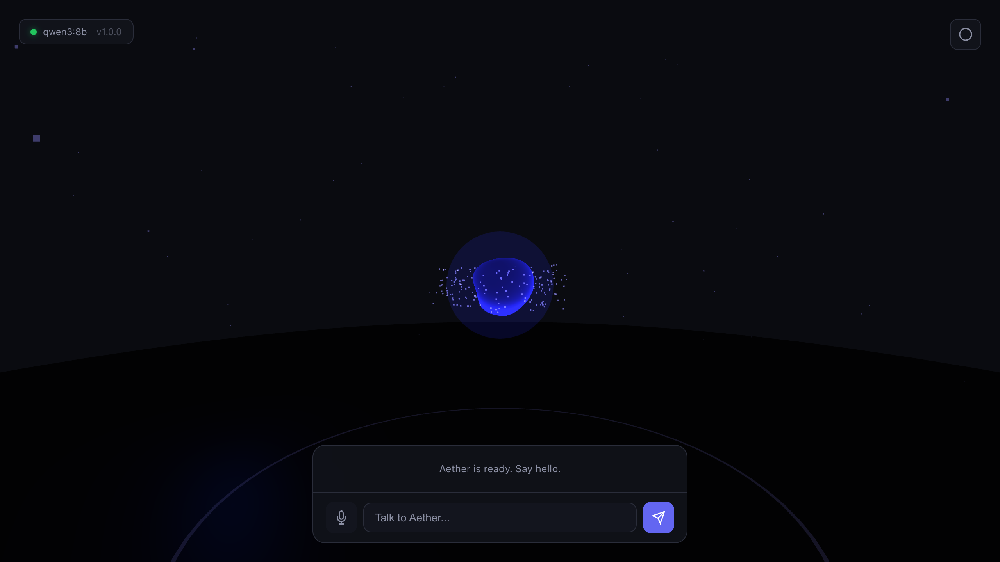
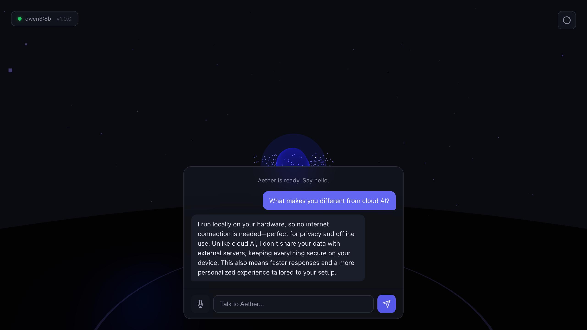
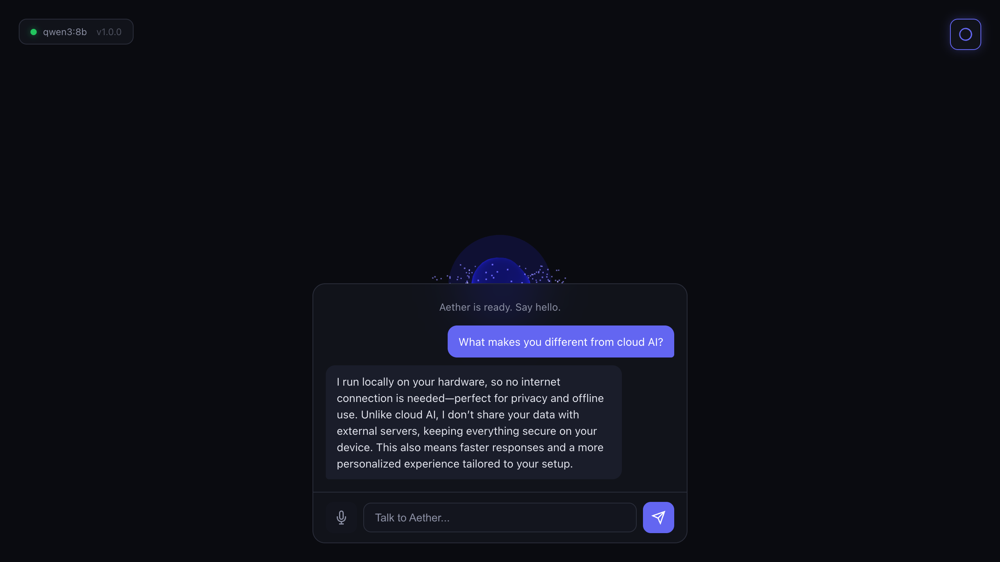
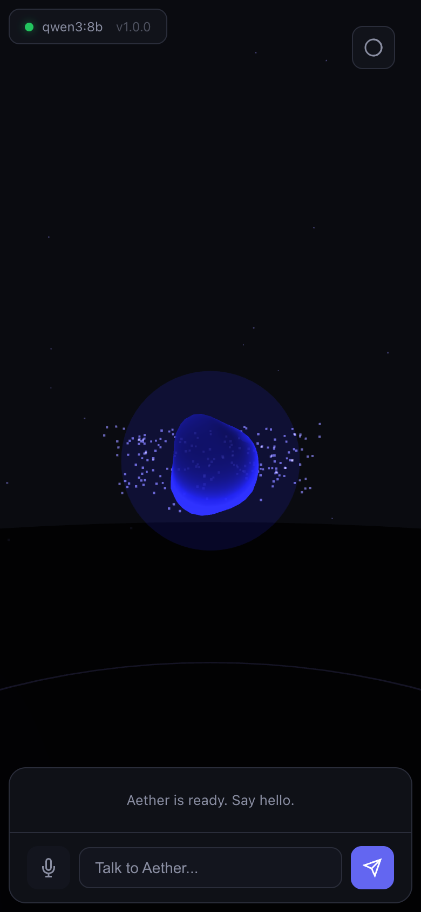

<p align="center">
  
</p>

<h3 align="center">A spatial AI companion that lives in your physical space</h3>

<p align="center">
  WebXR-powered &bull; Fully local &bull; Powered by Ollama &bull; No cloud, no data leaves your machine
</p>

<p align="center">
  <a href="#quick-start"><strong>Quick Start</strong></a> &bull;
  <a href="#features"><strong>Features</strong></a> &bull;
  <a href="#webxr"><strong>WebXR</strong></a> &bull;
  <a href="#architecture"><strong>Architecture</strong></a> &bull;
  <a href="https://ci.computer/store"><strong>Marketplace</strong></a>
</p>

---

<p align="center">
  
</p>

<p align="center">
  
  &nbsp;&nbsp;
  
</p>

<p align="center">
  
</p>

---

## What is Aether?

Aether is a **glowing holographic AI companion** that floats in your room. Talk to it by voice or text. It responds using a local LLM running on your own hardware — no internet required, no data ever leaves your machine.

In **WebXR mode** (Apple Vision Pro, Meta Quest), the companion appears in your physical space as an interactive particle orb. On desktop, it renders as a beautiful 3D scene in your browser.

```
You: "What makes you different from cloud AI?"

Aether: "I run locally on your hardware, so your data never
 leaves your device — no cloud storage, no internet dependency.
 Think of me as a personalized, always-on companion tailored
 to your space."
```

## Features

### Reactive Particle Orb Avatar

The companion is a custom-shader particle orb built with Three.js. It reacts in real-time to conversation state:

| State | Color | Behavior | Trigger |
|:------|:------|:---------|:--------|
| **Idle** | Purple | Slow orbit, gentle breathe | Default |
| **Listening** | Blue | Particles accelerate | Mic active |
| **Responding** | Green | Particles scatter, pulse per token | LLM streaming |
| **Error** | Red | Contract, brief flash | Connection lost |

The orb's vertex shader uses simplex noise displacement, with a fresnel glow fragment shader. Each streaming token triggers a visual pulse — the faster the model generates, the more alive the companion feels.

### Streaming Local LLM Chat

- Multi-turn conversation with full history
- Token-by-token WebSocket streaming from Ollama
- Works with any Ollama model — llama3, mistral, qwen, phi, gemma, etc.
- System prompt shapes the companion's personality
- Conversation exists only in RAM — zero persistence, maximum privacy

### Voice Input & Output

- **Speech-to-text** via Web Speech API — click the mic and talk
- **Text-to-speech** via SpeechSynthesis — hear Aether's responses
- Requires HTTPS or localhost (browser security requirement)

### WebXR Spatial Computing

- **Apple Vision Pro** — immersive-ar with passthrough, companion in your room
- **Meta Quest 2/3/Pro** — AR passthrough or full VR mode
- **Hit-test placement** — tap a surface to place the companion
- **DOM overlay** — chat panel stays visible in XR
- **Desktop fallback** — inline 3D with mouse orbit, no headset needed

## Quick Start

### Docker (recommended)

```bash
git clone https://github.com/ibrews/aether-companion.git
cd aether-companion
docker-compose up -d
```

Open `http://localhost:3456` in your browser.

### Without Docker

```bash
git clone https://github.com/ibrews/aether-companion.git
cd aether-companion
npm install
node server.js
```

### Prerequisites

1. **Ollama** running on the host machine
   ```bash
   # Install: https://ollama.ai
   ollama pull llama3.2    # or any chat model
   ollama serve            # starts on port 11434
   ```

2. **Node.js 20+** (if running without Docker)

3. **A modern browser** — Chrome 113+, Safari 17+, Firefox 120+

### Configuration

| Variable | Default | Description |
|:---------|:--------|:------------|
| `PORT` | `3456` | Server port |
| `OLLAMA_HOST` | `http://localhost:11434` | Ollama API endpoint |
| `OLLAMA_MODEL` | `qwen3:8b` | Default model for inference |

Override via environment variables or in `docker-compose.yml`.

## Architecture

```
                    Browser (Vision Pro / Quest / Desktop)
                    +--------------------------------------+
                    |  Three.js scene (WebGL/WebXR)        |
                    |  +-- Particle orb companion           |
                    |  +-- Custom vertex/fragment shaders   |
                    |  +-- Ambient particles + ground       |
                    |                                      |
                    |  Chat panel (glassmorphism overlay)   |
                    |  +-- WebSocket client                 |
                    |  +-- Web Speech API (STT/TTS)         |
                    +----------------+---------------------+
                                     | WebSocket
                                     v
+----------------------------------------------------+
|  Docker Container (Node 20 Alpine)                 |
|                                                    |
|  Express server (port 3456)                        |
|  +-- Static file serving                           |
|  +-- /api/health, /api/config                      |
|  +-- WebSocket server (ws)                         |
|       +-- Streams tokens from Ollama               |
|       +-- Maintains per-connection chat history    |
+----------------------------------------------------+
                         | HTTP streaming
                         v
              +---------------------+
              |  Ollama (port 11434)|
              |  Local LLM inference|
              +---------------------+
```

### Project Structure

```
aether-companion/
  server.js              # Express + WebSocket + Ollama proxy
  Dockerfile             # Node 20 Alpine container
  docker-compose.yml     # One-command deployment
  public/
    index.html           # App shell
    css/styles.css       # Dark theme, glassmorphism
    js/
      app.js             # Bootstrap + wiring
      scene.js           # Three.js scene, camera, lighting
      companion.js       # Particle orb + shaders + animation
      xr-manager.js      # WebXR AR/VR session management
      chat.js            # WebSocket streaming chat client
      speech.js          # Voice input (STT) + output (TTS)
    lib/
      three.module.js    # Three.js r162 (bundled, no CDN)
```

### Design Decisions

- **Particle orb, not humanoid** — Visually striking, no 3D modeling needed, performant on Quest
- **Vanilla JS + Three.js** — No build step, no framework. Self-contained in Docker
- **WebSocket streaming** — Token-by-token for real-time feel, not request-response
- **Ollama `/api/chat`** — Multi-turn with system prompt, proper conversation history
- **No database** — Conversation lives in RAM only. Privacy by design.

## WebXR

### Testing WebXR Locally

**On Vision Pro:**
1. Ensure your Mac and Vision Pro are on the same network
2. Open Safari on Vision Pro, navigate to `http://<your-mac-ip>:3456`
3. Tap "Enter AR"
4. Look at a surface and tap to place the companion

**On Quest:**
1. Open Quest Browser, navigate to `http://<your-pc-ip>:3456`
2. Tap "Enter AR" (passthrough) or "Enter VR"
3. Point at a surface and click to place

**Desktop (no headset):**
- The 3D scene renders inline — mouse movement orbits the camera
- Full chat functionality works without XR

### WebXR Features

| Feature | Vision Pro | Quest 2/3 | Desktop |
|:--------|:-----------|:----------|:--------|
| 3D companion | Yes | Yes | Yes |
| AR passthrough | Yes | Yes (Quest 3) | No |
| Hit-test placement | Yes | Yes | N/A |
| DOM overlay chat | Yes | Yes | N/A (inline) |
| Voice input | HTTPS only | HTTPS only | Localhost OK |
| Hand tracking | Planned | Planned | N/A |

## Privacy & Security

This is a **zero-trust, zero-cloud application**:

- All inference runs locally via Ollama — no API keys, no external calls
- No telemetry, analytics, or tracking of any kind
- Conversation history exists **only in RAM** during the WebSocket session
- Closing the tab destroys all data permanently
- The Docker container makes **no outbound network connections**
- No cookies, no localStorage, no service workers

Your AI companion is truly yours.

## CI.computer Companion Marketplace

Aether Companion is designed for the [CI.computer](https://ci.computer) ecosystem — local AI hardware running Companion OS. It ships as a Docker container that connects to the host's Ollama instance, making it a one-click deploy from the Companion Hub.

**Why Aether for Companion OS:**
- Leverages the Companion Core's 128GB RAM for running large local models
- WebXR interface works from any device on the local network
- Zero cloud dependency aligns with CI's privacy-first philosophy
- Lightweight container (~50MB) with no external dependencies

## Tech Stack

| Layer | Technology |
|:------|:-----------|
| Runtime | Node.js 20 (Alpine) |
| Server | Express 4.21 + ws 8.16 |
| 3D Engine | Three.js r162 |
| XR | WebXR Device API |
| AI | Ollama (local inference) |
| Voice | Web Speech API + SpeechSynthesis |
| Container | Docker + docker-compose |
| UI | Vanilla JS, CSS glassmorphism |

## Contributing

Contributions welcome. The codebase is intentionally simple — vanilla JS, no build step, no framework dependencies.

```bash
# Run locally
npm install
OLLAMA_HOST=http://localhost:11434 node server.js

# Run in Docker
docker-compose up --build
```

## License

MIT

---

<p align="center">
  Built by <a href="https://agilelens.com">Agile Lens</a> for the <a href="https://ci.computer">CI.computer</a> Companion Marketplace
</p>
